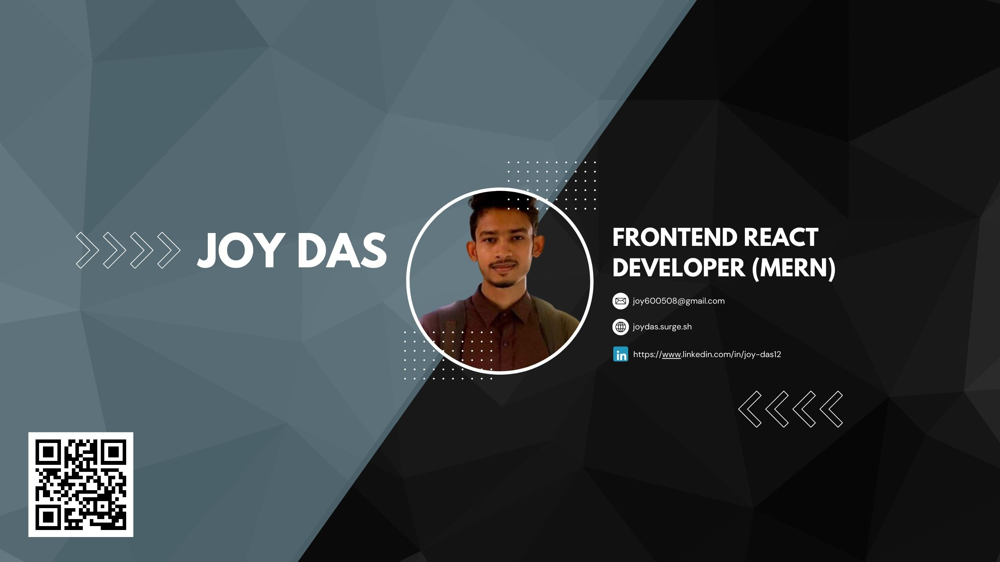

#  

# Hi, I'm Joy Das

I am an experienced MERN Stack Developer with a strong
background in MongoDB, Express.js, React, and Node.js.
Passionate about crafting user-centric web applications and
eager to contribute expertise to innovative projects. Seeking
collaborative opportunities to excel in web development,
overcome challenges, and deliver impactful solutions

## Technology and Tools

  

## About Me

- 🔭 I’m currently working on expanding my expertise in [MERN Stack].
- 🌱 I’m currently learning [Nextjs].
- 👯 I’m looking to collaborate on innovative projects that push boundaries.
- 💬 Ask me about anything related to frontend development, React, or the MERN stack.
- 📫 How to reach me: [joy600508@gmail.com](mailto:joy600508@gmail.com)

## Pinned

### Technology Used

 

  
